<p align="center"><a src="https://github.com/wizsk/arabic_lexicons/releases/latest"></a></p>

# Arabic Lexicons

Arabic Lexicons provides access to 6 classical Arabic lexicons,
2 Arabic-English lexicons, and 1 Arabic-English dictionary -
all working completely offline.

**See [Available Dictionaries](#available-dictionaries) for details.**

## Features

<!-- **Arabic Lexicons** gives you instant access to multiple authoritative Arabic dictionaries: -->

- **Multi-word search**: Search for several words simultaneously
- **Quick switching**: Easily switch between different words and lexicons
- **Reader mode**: Read Arabic text or poetry - tap any word for its meaning
- **Fully offline**: The app doesn't even require internet permission - all dictionaries work completely offline
- **BookMark**: BookMark words to review later. And highligh words while reading.
- **Lightweight design**: Despite containing extensive lexical data, the app is optimized to be as small as possible (~60MB, mostly the compressed database)

**Go to [Screenshots](#screenshots) to see the features in action**

## Download

Get the latest version from the [releases page](https://github.com/wizsk/arabic_lexicons/releases/latest).

<p> <a href="https://github.com/wizsk/arabic_lexicons/releases/latest"></a></p>

## Reader Mode

Paste any Arabic text into the Reader Mode and read with ease. Simply tap on any word in the text to see its meaning instantly. This feature is perfect for:

- Reading Arabic articles or documents
- Qasidah Mode for reading Arabic poems
- Learning new vocabulary in context
- Quick reference while studying

## Available Dictionaries

The app includes 9 comprehensive dictionaries - 2 English-Arabic dictionaries and 7 Arabic-only dictionaries:

**English-Arabic Dictionaries:**

1. **Direct Dictionary** (مباشر) - Arabic to English translation
2. **Hans Wehr** (هانز) - The most widely used modern Arabic-English dictionary
3. **Lane Lexicon** (لين) - Classical Arabic-English lexicon, highly detailed

**Arabic Dictionaries:**

4. **Al-Ghani** (الغني) - Mujam al-Ghani, comprehensive Arabic dictionary
5. **Mukhtar** (مختار) - Mukhtar al-Sihah, concise classical dictionary
6. **Lisan Al-Arab** (لسان) - The most comprehensive classical Arabic dictionary
7. **Al-Muashirah** (المعاصرة) - Modern Arabic dictionary
8. **Al-Waseet** (الوسيط) - Al-Mu'jam al-Waseet, medium-sized modern dictionary
9. **Al-Muhit** (المحيط) - Al-Muhit, comprehensive Arabic dictionary

## Screenshots

**Main page. Lexicon and Word Switcher:**

> Click on the bookmark icon on top or **press and hold** on the word in the word switcher to bookmark the word.

[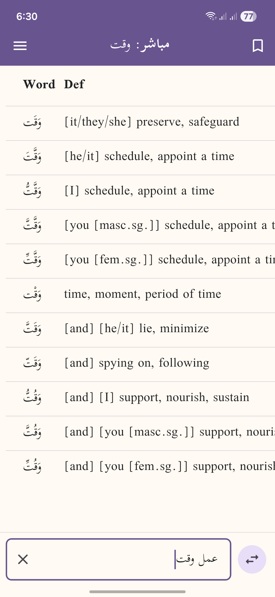](fastlane/metadata/android/en-US/images/phoneScreenshots/0.png)
[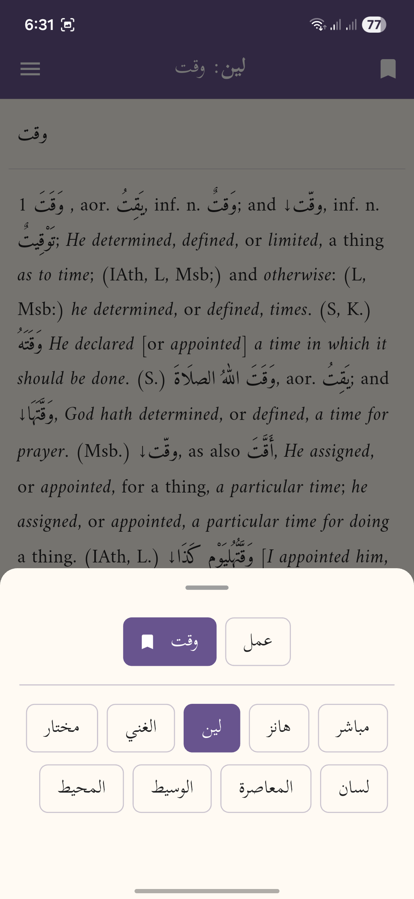](fastlane/metadata/android/en-US/images/phoneScreenshots/1.png)

**Reader Page**:

> Click on any word to see the meanings or bookmark/highlight it.

[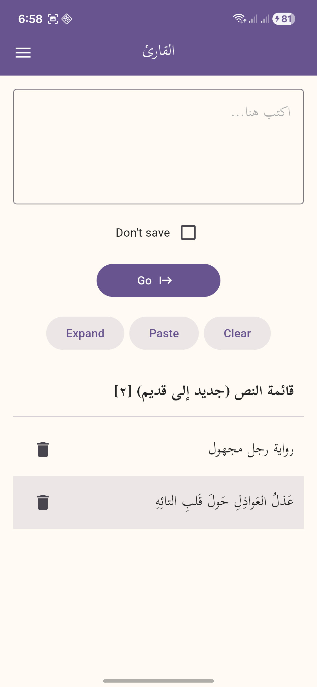](fastlane/metadata/android/en-US/images/phoneScreenshots/10.png)
[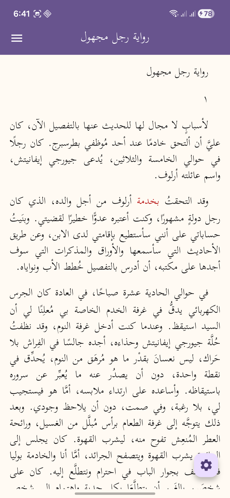](fastlane/metadata/android/en-US/images/phoneScreenshots/2.png)
[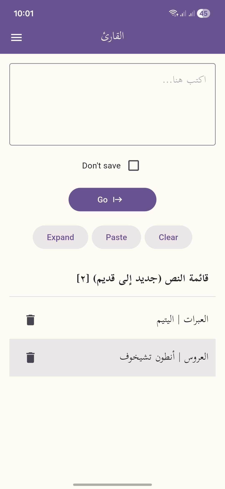](fastlane/metadata/android/en-US/images/phoneScreenshots/3.png)
[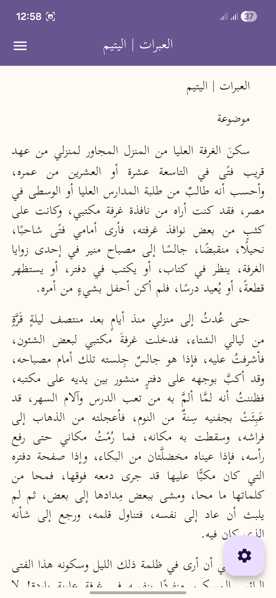](fastlane/metadata/android/en-US/images/phoneScreenshots/4.png)

**Qasidah(Poem) Mode**:

[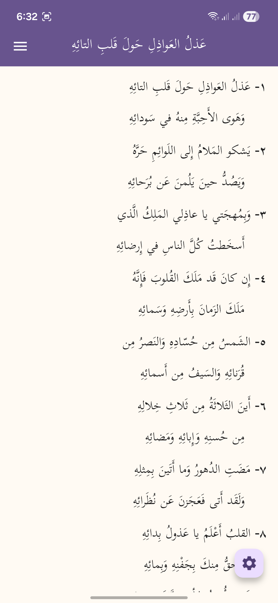](fastlane/metadata/android/en-US/images/phoneScreenshots/5.png)

**Lastly**:

> BMs aka Bookmarks page, click on the word to open dictionary.

[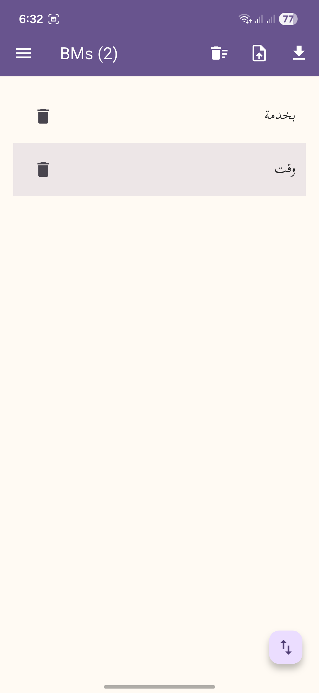](fastlane/metadata/android/en-US/images/phoneScreenshots/6.png)
[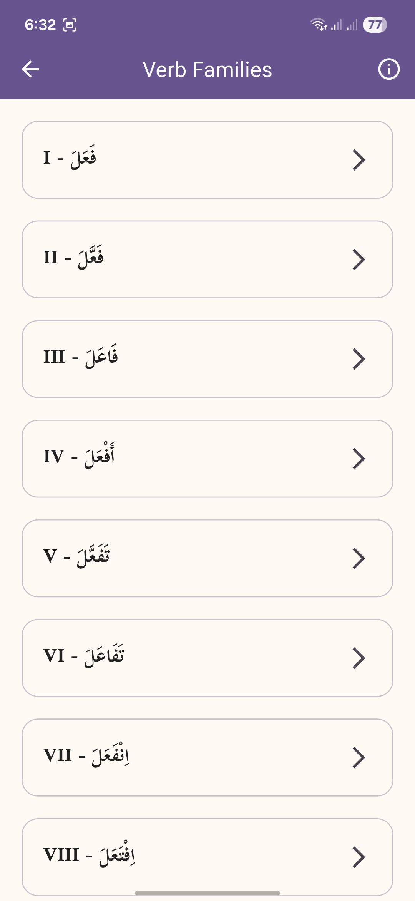](fastlane/metadata/android/en-US/images/phoneScreenshots/7.png)
[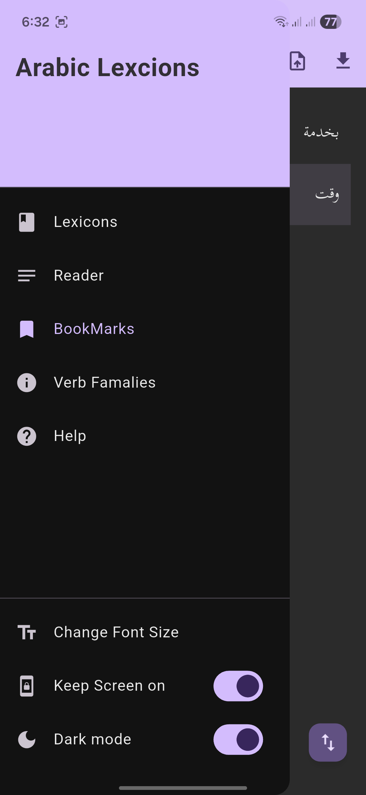](fastlane/metadata/android/en-US/images/phoneScreenshots/8.png)
[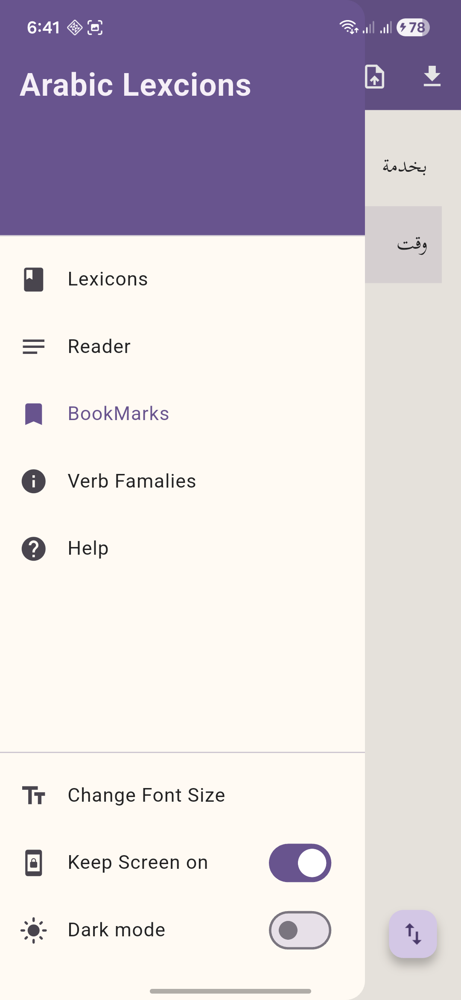](fastlane/metadata/android/en-US/images/phoneScreenshots/9.png)

## Build or run

```sh
git clone https://github.com/wizsk/arabic_lexicons.git
cd arabic_lexicons
unzip -o assets/data/db.sqlite.zip -d assets/data/
flutter pub get
flutter run # flutter build apk
```

## License

This project is fully open source and released under the **GPL-3.0 License**.
