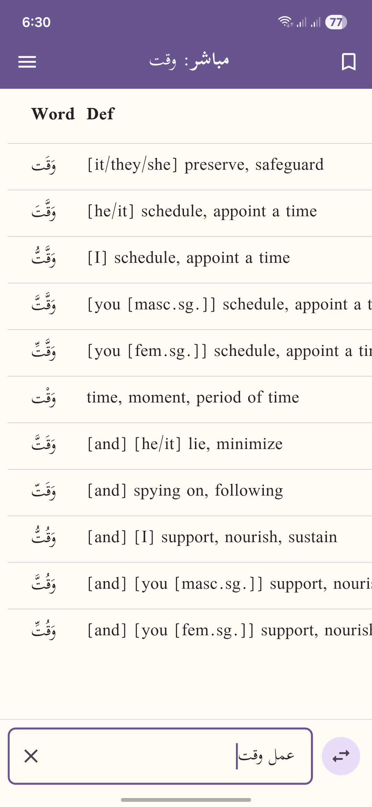
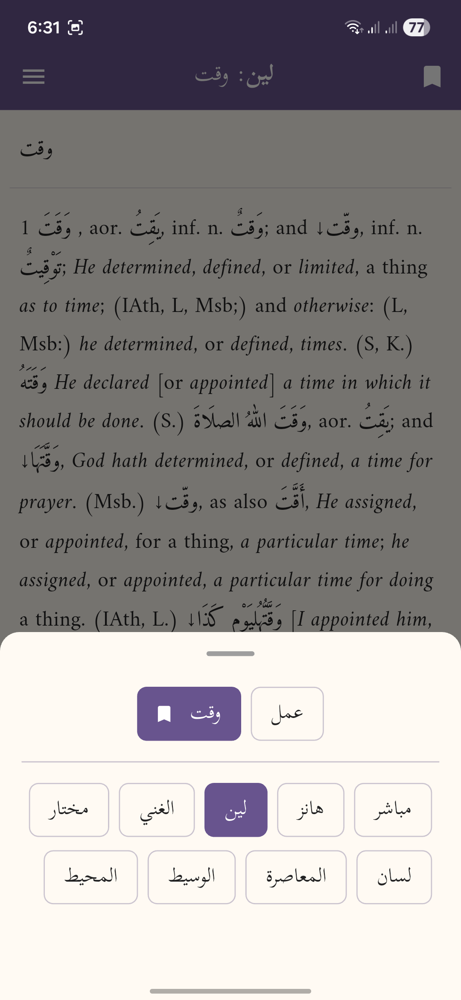
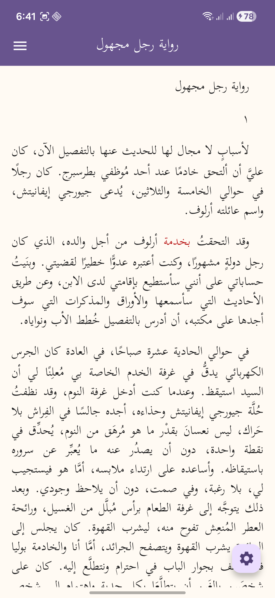
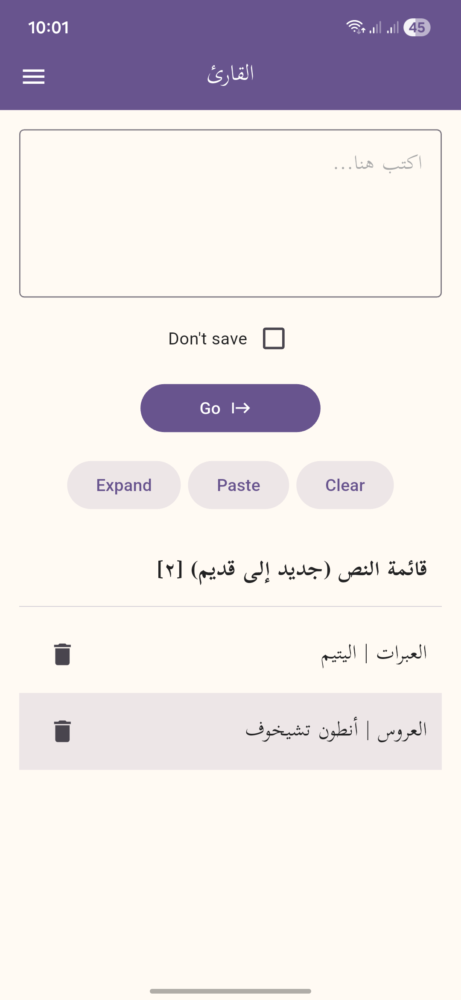
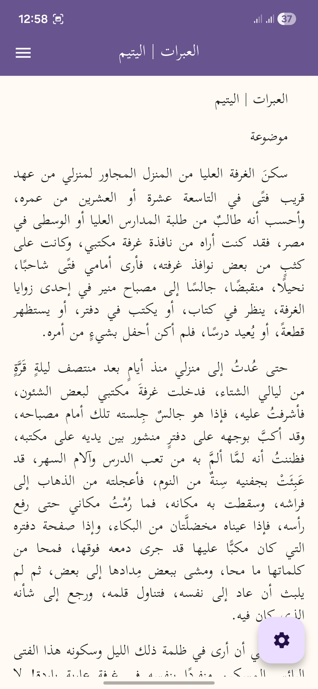
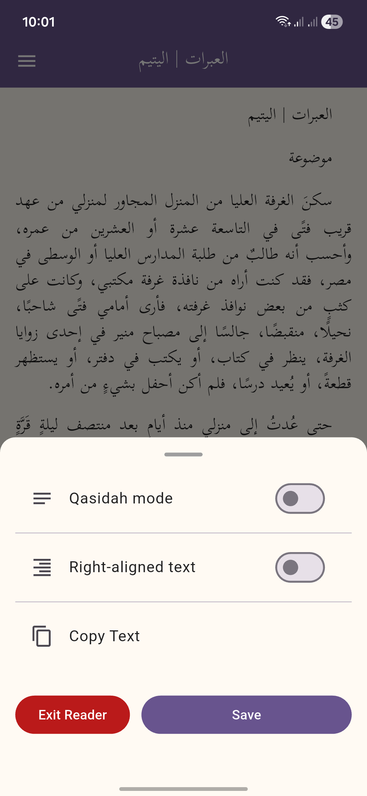
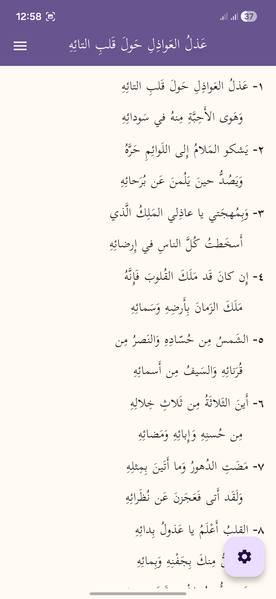
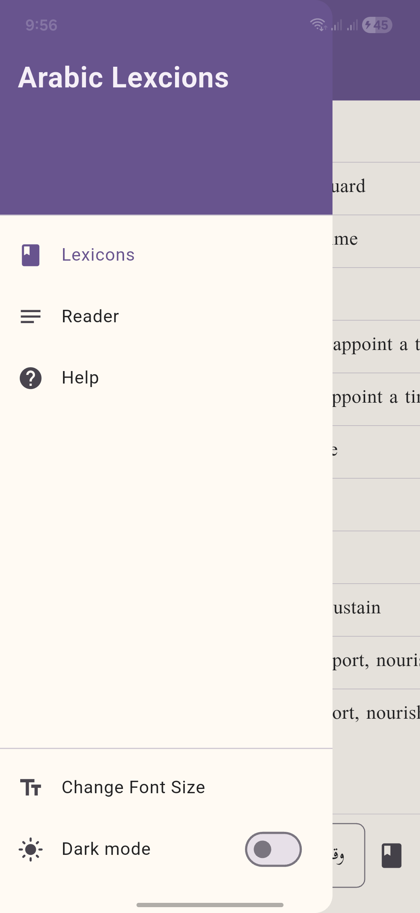
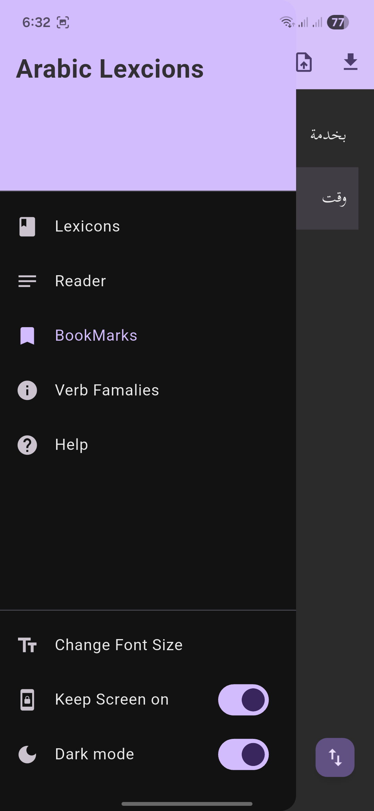

<div align="center">

<a src="https://github.com/wizsk/arabic_lexicons/releases/latest"></a>

# Arabic Lexicons

[](https://github.com/wizsk/arabic_lexicons/releases/latest)
[](https://github.com/wizsk/arabic_lexicons/releases)

### A libre Arabic dictionary & reader app

[](https://play.google.com/store/apps/details?id=io.github.wizsk.arabic_lexicons)
[](https://github.com/wizsk/arabic_lexicons/releases/latest/)
<!-- []() -->

#### Arabic Lexicons provides access to 8 classical Arabic lexicons, 2 Arabic-English lexicons, and 1 Arabic-English dictionary - all working completely offline.

[](fastlane/metadata/android/en-US/images/phoneScreenshots/0.png)
[](fastlane/metadata/android/en-US/images/phoneScreenshots/1.png)
[](fastlane/metadata/android/en-US/images/phoneScreenshots/2.png)
[](fastlane/metadata/android/en-US/images/phoneScreenshots/3.png)
[](fastlane/metadata/android/en-US/images/phoneScreenshots/4.png)
[](fastlane/metadata/android/en-US/images/phoneScreenshots/5.png)
[](fastlane/metadata/android/en-US/images/phoneScreenshots/6.png)
[](fastlane/metadata/android/en-US/images/phoneScreenshots/7.png)
[](fastlane/metadata/android/en-US/images/phoneScreenshots/8.png)

</div>

## Verify

Certificates Hash

```
SHA-256: 324fc0e3f874d505e7130846cd2c8b03de78a0ec22e0362c11324bada54c3c77
SHA-1: 7bfafacbccbb383f219bf2c4aed819882a73eee8
```

## Available Dictionaries

The app includes 9 comprehensive dictionaries - 2 English-Arabic dictionaries and 7 Arabic-only dictionaries:

**English-Arabic Dictionaries:**

1. **Direct Dictionary** (مباشر) - Arabic to English translation
2. **Hans Wehr** (هانز) - The most widely used modern Arabic-English dictionary
3. **Lane Lexicon** (لين) - Classical Arabic-English lexicon, highly detailed

**Arabic Dictionaries:**

4. **Al-Ghani** (الغني) - Mujam al-Ghani, comprehensive Arabic dictionary
5. **Mukhtar** (مختار) - Mukhtar al-Sihah, concise classical dictionary
6. **Lisan Al-Arab** (لسان) - The most comprehensive classical Arabic dictionary
7. **Al-Muashirah** (المعاصرة) - Modern Arabic dictionary
8. **Al-Waseet** (الوسيط) - Al-Mu'jam al-Waseet, medium-sized modern dictionary
9. **Al-Muhit** (المحيط) - Al-Muhit, comprehensive Arabic dictionary
10. **Maqayis al-Lugha** (مقاييس) - Root-based semantic analysis by Ibn Faris (4th century AH)
11. **Mufradat Alfaz al-Qur’an** (مفردات) - Qur’anic lexicon by al-Raghib al-Isfahani

## Features

<!-- **Arabic Lexicons** gives you instant access to multiple authoritative Arabic dictionaries: -->

- **Multi-word search**: Search for several words simultaneously
- **Quick switching**: Easily switch between different words and lexicons
- **Advanced Search suggesions**: For finding words with ease
- **Reader mode**: Read Arabic text or poetry - tap any word for its meaning
- **Fully offline**: The app doesn't even require internet permission - all dictionaries work completely offline
- **BookMark**: BookMark words to review later. And highligh words while reading.
- **Lightweight design**: Despite containing extensive lexical data, the app is optimized to be as small as possible (Database is ~50mb compressed + other resources)

## Reader Mode

Paste any Arabic text into the Reader Mode and read with ease. Simply tap on any word in the text to see its meaning instantly. This feature is perfect for:

- Reading Arabic articles or documents
- Qasidah Mode for reading Arabic poems
- Learning new vocabulary in context
- Quick reference while studying

## Build or run

```sh
git clone https://github.com/wizsk/arabic_lexicons.git
cd arabic_lexicons
unzip -o assets/data/db.sqlite.zip -d assets/data/
flutter pub get
flutter run # flutter build apk
```

## License

This project is fully open source and released under the **GPL-3.0 License**.

# Acknowledgements

- Thanks to [HansWehrDictionary](https://play.google.com/store/apps/details?id=com.muslimtechnet.lanelexicon) by [GibreelAbdullah](https://github.com/GibreelAbdullah/)
- Thanks to [LaneLexicon](https://play.google.com/store/apps/details?id=com.muslimtechnet.hanswehr) by [GibreelAbdullah](https://github.com/GibreelAbdullah/)
- Thanks to [معجم العرب](https://play.google.com/store/apps/details?id=com.ristekmuslim.mujamarob) by Ristek Muslim

for their amazing works and providing us with the databases